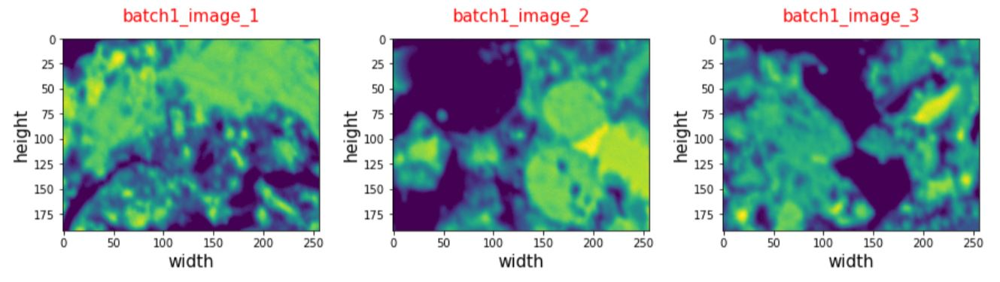
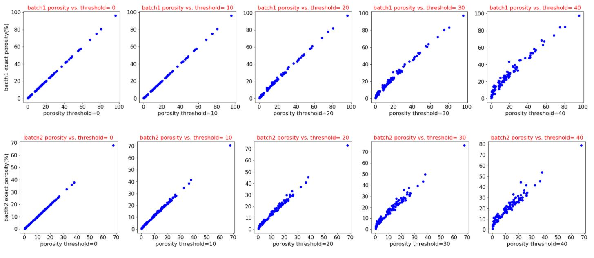

# Methods:

## Exploratory Data Analysis (EDA)

In the present project, EDA plays an integral role project for identification, characterization, or quantification of different features. The input data used consists of two columns: images (IDs), and their correspondent porosity exported by ImageJ commercial software. Fig 1 shows porosities of five random images for each batch, ranging from 0 to 100 percent.

    Figure 1: Importing tabular data for EDA

It is worth noting that each Batch 1 and 2 has 100 images, which will be used for porosity characterization. The first three images chosen from batch1 are shown in Fig 2:
               

    Figure 2: Importing first three random images from batch1

As shown in Fig 2, images were shown in Viridis color system. However, there are two problems associate with the Viridis color system used for reading images. Firstly, there is a significant variation of colors for low thresholds, i.e. ranging from 0 to 10, hence porosity quantification may subject to instability. Secondly, identification and quantification of cement hydration products has been done in Greyscale color system [4]. Consequently, it is required to convert Viridis to Greyscale color system to enhance accuracy of EDA. Fig 3 provides a comparison of these two different color systems.

    Figure 3: Comparison of Viridis vs. Greyscale color systems for reading images in python 

As previously mentioned, the color system of images had to be converted to Greyscale to improve stability chemical analysis of hydrates, as well as to ease identification, as and quantification of porosity in cement paste matrix. As shown in Fig 4, pixels having darker luminance may belong to capillary pores, intermediate thresholds represent hydrated products, and higher thresholds belongs to unknown phases, including anhydrous or aluminate [4]. 

    Figure 4: Identification and quantification of different phases using greyscale SEM images[4]
    
As a result, Fig 5 shows a converted version of Fig 1 from Viridis to Greyscale systems, used for EDA.  

   

    Figure 5: Transformation images from Viridis to Greyscale 
    
### Model Calibration
    
To quantify porosities and other characteristics of SEM images, including chemistry of hydrates and angularity of pores, it is a required task to calibrate the model. The input grayscale images are all having 256*196 pixels with grayscale thresholds ranging from 0 to 255; and as mentioned earlier, dark pixels represent pores, while pixels with higher threshold values represent cement hydration products or anhydrous phases. To quantify pore volume fraction, different thresholds correspond are chosen to determine the average porosity of images in each batch (see Fig 6). Fig 6 illuminates the maximum thresholds for both batches (i.e. 14 and 9 for batches 1 and 2, respectively), to avoid overestimation of porosity in each batch. As a side note, almost 400 million pixels were analyzed by python to generate this figure.

  

    Figure 6: quantification of average porosity vs. different threshold limits

Figs 7 and 8 represent the important role of assigning a correct threshold value for characterizing porosity. As shown in these figures, increasing the luminance (threshold) of images from a certain limit (i.e. i.e. 14 and 9 for batches 1 and 2, respectively) will result in the overestimation of porosities due to the inclusion of dark hydration products (e.g. periclase or brucite).
    
    

    Figure 7: dependence of batch1 porosity on the assigned luminance 

 

    Figure 8: dependence of batch1 porosity on the assigned luminance

Therefore, luminance of images should be carefully assigned to realistically estimate porosity with minimum error. Fig 9 further illuminates dependence of image analysis on the assigned threshold. In this figure, the exact porosities of images found from ImageJ software are compared with those estimated by EDA. This comparison reveals that as long as the luminance is limited to 10, calculated porosities remain stable and accurate for both batches, while exceeding this limit results in over estimation of porosities. 
    
 

    Figure 9: Matching estimated vs. exact porosities for different threshold limits

Considering Fig 9, the threshold limit = 0 is finally chosen to accurately estimate the porosity of images for all batches. 

### Chemical Analysis of Cement Hydration Products

As previously mentioned, greyscale SEM images are required to be considered for chemical analysis [4]. The following thresholds intervals are defined for each image to characterize different phases:

* Capillary Pores: 0 < threshold < 1
* Magnesium/ Sulphur: 10 < threshold < 70
* Calcium Silicate Hydrates (C-S-H): 70 < threshold < 140
* Calcium Hydroxide/ Portlandite (C-H): 140 < threshold < 180
* Unknown (Anhydrous/ Aluminate): 180 < threshold < 255

To determine the robustness of chemical analysis using the present image-based analysis, a random image from batch1 is selected and characterized in Fig 10.

 

    Figure 10: Chemical analysis of greyscale SEM images
    
### Angularity of Capillary Pores

In the next step, the shape of capillary pores is characterized using a terminology called angularity, defined in this research. For this purpose, a dimensionless formula is expressed to calculate angularity of pores based on their total perimeter and area as follows:

 

As shown in Fig 11, for capillary pores having similar area, the perimeter increases with angularity [5]. In other words, pores having similar perimeter, but less angularity have larger areas.

 

    Figure 11: comparing round vs angular shapes
    
Accordingly, it is required to calculate area and perimeter of capillary pores in each figure. Based on trial-and-error attempts, the threshold interval for calculating area of pores is found to be 0 < threshold < 1, while to estimate perimeter, the interval is modified to 1 < threshold < 30. Also, including higher threshold limits (i.e. 30 < threshold < 60) would incorporate hydrates having relatively darker luminance, e.g. periclase or brucite, which may result in overestimation of porosity. Fig 12 shows estimation of total area as well as total perimeter, as a function of luminance interval, used to estimate angularity of each image.

 

    Figure 12: Estimating required parameters for estimating angularity 

### Application of Artificial Neural Network (ANN) for estimating porosity

The ANN models shown below explain how cement chemistry (model I) together with a combination of cement chemistry and pore physical shape (model II) could be used to estimate porosities, i.e. output, of testing batch 3 (Fig 13).

 

    Figure 13: ANN models used for estimating porosities

The first step for doing ANN is to determine the type of variables used for training the datasets. As shown in Fig 14, the variables shown are all in float 64 type. However, only float32 datatype works well for tensor flow, and the variables are hence converted to this datatype. 

 

    Figure 14: Representing the type of input variables
    
The structure of employed ANN model consists of layers having different complexities, which are placed sequentially. As well, 1024 intermediate nodes are generated by matrix multiplications using ReLU rectifier to facilitate prediction of the nonlinear model, see Fig 15. To control the speed and quality of learning process, the value of other hyperparameters including, learning rate, epochs, and batch size are set to be 0.0001, 300, and 50, respectively.  

 

    Figure 15: Creating ANN model to estimate porosities

### this part to be completed by Faisal

As a result, all 200 SEM images from bach 1 and 2 were analyzed to determine if there is any data could be extracted. Figures 6 and 7 shows how the distribution of greyscale values within the batch 1. 

Also, figures 8 and 9 shows how the distribution of greyscale values within the batch 2.

## Modeling

Complex model has been built using Convolutional Neural Network (CNN) approach. Having the images from the training set coincided with their labels (porosity values) as the input of the model. This model will be freezed while fetching and processing a previous model performed on a very big data (images). The usual image data set “imagenet” is used as a preprocessed model to let the model train in a complex way to understand and identify images.
Due to having a very limited number of images, we had to divide porosity into categories in order to make it easier to the model to predict for a limited number of outputs (labels). This division was done by some of the team members as a way of variety in this project. However, in any real case study, specifing categories will be needed to make it more reasonable to predict physiochemical properties such as freezing and thawing since freezing and thawing behavior for example is changing discretely e.g: very poor, poor, acceptable, good, very good.

Image augmentation is pretty important in image processing. As we deal with pixels values and shapes, we focused on image flipping and sizing augmentation rather than color augmentation since we deal with grayscale images and pixels values.

