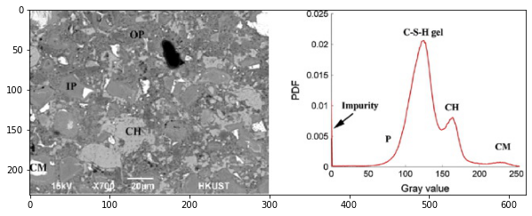

# Methods:

## Exploratory Data Analysis

Exploratory data analysis (EDA) is an important step conducted in any data analysis project for identification, and characterization of different features. In this project, our input data consists of two columns, images (IDs) and their corresponding porosity which were calculated using ImageJ commercial software. Figure 1 shows porosities of the first 5 images for each batch.

    Figure 1: importing tabular data for EDA

As shown in Figure 1, porosities vary from 0 to 100 percent. It is worth noting that each Batch 1 and 2 has 100 images, which will be for porosity characterization. Image processing plays an integral role for understanding the general characterestics of pore system. The first three images chosen from batch1 are shown in Fig 2:
               

    Figure 2: importing first three images from batch1

As shown in Fig 2, images were shown in Viridis color system. However, there are two problems associate with the Viridis color system used for reading images. Firstly, there is a significant variation of color for thresholds ranging from 0 to 10, hence porosity quantification may subject to instability. Secondly, identifiaction and quantification of cement hydration products has been done in Greyscale color system [1]. Consequently, it is required to convert Viridis to Greyscale color system to enahnce accuracy of EDA. Fig 3 provides a comparison of these two different color systems

    Figure 3: comparison of Viridis vs. Greyscale color systems for reading images in python 

As previously mentioned, the color system of images had to be converted to Greyscale to faciliate chemical analysis of hydartes, and to ease  identification, as well as quantification of porosity in cement paste matrix. In Fig 4, it is shown that pixels having darker luminance belong to capillary pores, intermediate thresholds belong to hydrated products, and high thresholds corresponds to unhydrated products, i.e. unhydrated cementitious materials or aluminate phases. 

    Figure 4: identifiaction and quantification of different phases for greyscale SEM images
    
As a result, Fig 5 shows a converted version of Fig 1 transformed from Viridis to Greyscale, whcih are used for further EDA.  

   

    Figure 5: transformation of input images from Viridis to Greyscale 
    
The input grayscale images are all having 256*196 pixels with grayscale values ranging from 0 to 255; dark pixels are having threshold values close to zero , and pixels with higher thershold values are brighter and represents cement hydrated products in gray and white colors. To quantify pore volume fraction, different thresholds correspond to pores are chosen to determine the impact of threshold limit on the averge porosity (see Fig 5). Fig 5 illuminates the maximum thresholds for both batches (i.e. 14 and 9 for batches 1 and 2, respectively), which avoids overestimation of porosity in both batches.

  

    Figure 5: quantification of average porosity vs. threshold limits
To quantify diffent phases and the amount of chemica products in images, different threshols are chosen to differentiate between these phases and the chemical products.

To quantify pore volume fraction, different thresholds correspond to pores are chosen to determine the impact of threshold limit on the averge porosity (see Fig 5). Fig 5 illuminates the maximum thresholds for both batches (i.e. 14 and 9 for batches 1 and 2, respectively), which avoids overestimation of porosity in both batches. 

The images from baches 1 and 2 were analyzed to figure out if there is any data could be extracted. Figures 6 and 7 shows how the distribution of greyscale values within the batch 1. 

Also, figures 8 and 9 shows how the distribution of greyscale values within the batch 2.

## Modeling

Complex model has been built using *Convolutional Neural Network* (CNN) approach. Having the images from the training set coincided with their labels (porosity values) as the input of the model. This model will be freezed while fetching and processing a previous model performed on a very big data (images). The usual image data set “imagenet” is used as a preprocessed model to let the model train in a complex way to understand and identify images.
Due to having a very limited number of images, we had to divide porosity into categories in order to make it easier to the model to predict for a limited number of outputs (labels). This division was done by some of the team members as a way of variety in this project. However, in any real case study, specifing categories will be needed to make it more reasonable to predict physiochemical properties such as freezing and thawing since freezing and thawing behavior for example is changing discretely e.g: very poor, poor, acceptable, good, very good.

Image augmentation is pretty important in image processing. As we deal with pixels values and shapes, we focused on image flipping and sizing augmentation rather than color augmentation since we deal with grayscale images and pixels values.

