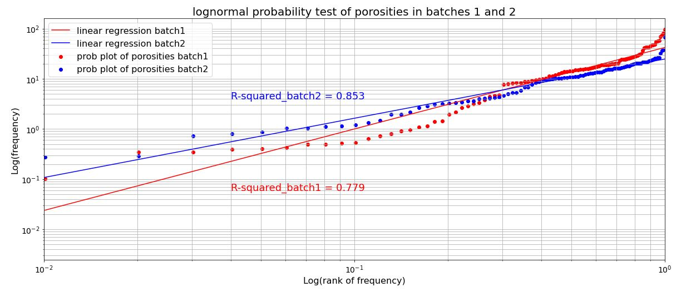

# Results:

## Exploratory Data Analysis

 ### Estimating Porosity Distribution 

Followed by doing model caliberation, it is now required to estimate distribution of porosities in each batch. For this purpose, histogram of porosites at threshold = 0 is sketched in Fig 10 for both batches using different bandwidth (bins) values. Considering this figure, histograms having smaller bins value, i.e. bins = 10, suggest lognormality of porosities in each batch. 

 

    Figure 10: finding distribution of porosities in each batch 
    
However, to determine whether the chosen lognormal distribution is valid, a method called probability plot was employed to prove lognormality of the distribution. Fig 11 shows a relatively high R-squared value found from the probability plot and validates the distribution.

 

    Figure 11: porbability plot test of lognormality
    
By proving the lognormality of porosityies in both batch 1 and 2, it is of interest to determine whether these two distribution matches at line y=x. Accordingly, the two lognormal distributions were plotted against on another, and shows a high affinity of, see Fig 12. It is worth noting that any point placed prior to the lognormal peak, specified with a dashed-line was eleminared from the matching procedure.  

 
As a way of variety, each student tried to deviate a little from the main work. The main work is to build an algorithm that will be able to identify porosity for images from the testing data set. Start writing about porosity, we saw from the explanatory data analysis that the porosity for each batch is normally distributed. Also, from the second plot, it is shown the frequency of porosity within each batch, and the average values of porosity for batch 1 is 18.52% and for batch 2 is 12.17% which are reasonable. The reason behind this explanatory data analysis is to see how porosity distributed among all images in each batch and identify if there is any image that could have unreasonable values. We also figured out that 

