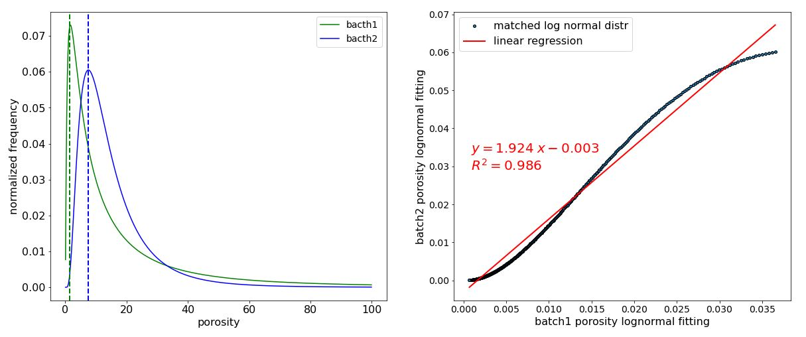
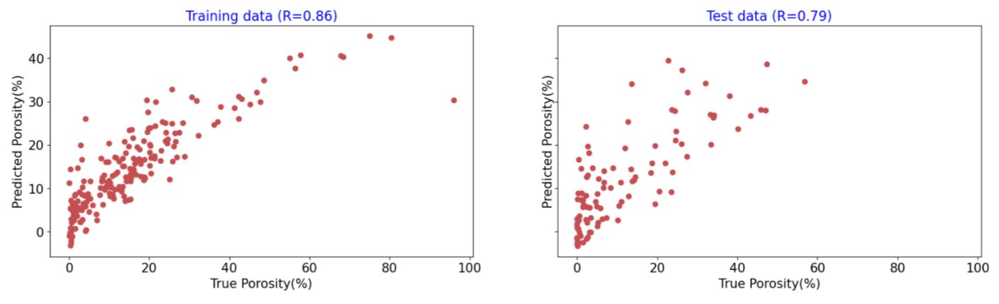

# Results and Discussion:

## Exploratory Data Analysis

As previously mentioned, EDA is an effective approach to analyze the present dataset and to identify, quantify, and characterize pore system in cement-based matrix.

 ### Estimating Porosity Distribution 

Followed by doing model caliberation, it is now required to estimate distribution of porosities in each batch. For this purpose, histogram of porosites at threshold = 0 is sketched in Fig 10 for both batches using different bandwidth (bins) values. Considering this figure, histograms having smaller bins value, i.e. bins = 10, suggest lognormality of porosities in each batch. 

 

    Figure 10: finding distribution of porosities in each batch 
    
However, to determine whether the chosen lognormal distribution is valid, a method called probability plot was employed to prove lognormality of the distribution. Fig 11 shows a relatively high R-squared value found from the probability plot and validates the distribution.

 

    Figure 11: porbability plot test of lognormality
    
By proving the lognormality of porosityies in both batch 1 and 2, it is of interest to determine whether these two distribution matches at line y=x. Accordingly, the two lognormal distributions were plotted against on another, and shows a high affinity of, see Fig 12. It is worth noting that any point placed prior to the lognormal peak, specified with a dashed-line was eleminared from the matching procedure.  

 

    Figure 12: matching lognormal distribution of porosities of batch1 and 2

## Feature Engineering

Using EDA, different features for characterizing porosity are extracted and shown in Fig 13. However, is a required task to determine whether these features are capable of estimating porosity 

 

    Figure 13: extracting features (physical and chemical) from SEM images
    
Considering Fig 14, only Calcium Silicate Hydrate (C-S-H), Portlandite (C-H), and Angularity features have strong correlation, i.e. either positive or negative, with porosity. Consequently, these feature are likely to be predictive of pore volume fraction for use in Neural Network.  

 

    Figure 14: SNS Heatmap of correlations between features extracted from image analysis

### Application of ANN for estimating porosities based on C-S-H & C-H (Model I)

In this step, extracted features corresponding to chemical properties of cement and highly correlred to pore volume fraction, i.e C-S-H and C-H, are selected to be predicitve of porosity. Considering Fig 15, it could be realized that the corrlation between porosity and C-S-H or C-H is not linear. Also, increasing porosity would result in a reduction in both C-S-H and C-H values. 

 

    Figure 15: Porosity vs. C-S-H or C-H for both batch1 and 2

To do ANN, training dataset has to be fed into the model. Fig 16 illusterates the features combined from batch 1 and 2, having 200 rows in total. 

 

    Figure 16: Training dataset used for ANN

Similarly, the testing dataset is fed into the model, which is used for validating the employed ANN. Fig 17 illusterates selected features from batch3, which has 100 rows in total. 

 

    Figure 17: Testing dataset used for ANN
    
To evaluate the accuracy of ANN results, RMSE is evaulated for both testing and validation data sets, see Fig 18. As shown in this figure, the RMSE value is continuously  decreasing by increasing the number of epochs for both sets, while no overfitting of data is observed. 

 

    Figure 18: Evaluation of RMSE vs. epochs in the first model
    
ANN also facilitates matching estimated versus true porosites of training and testing datasets, which are shown in Fig 19. This figure confirms the relatively high accuracy of results, i.e. approximately 90% and 80% for testing and training datasets using ANN inspite of having a limited number of, i.e. 200, SEM images. 

 

    Figure 19: matching porosities for training and testing datasets, first model 
 
As a result, Model I ANN predicted porosity based on chemistry of cement hydrates. It was realized that increasing the level of C-S-H and C-H, which are main components of cement hydration products, is probabely an indication of sifficient cement curing, which is also known as matrix densification. The matrix densification minimizes the size of capillary pores, which explains why in Fig 15, porosity is anticorrelated with C-S-H or C-H. 

### Appllication of ANN for estimating porosities based on C-S-H & Angularity (Model II)

It is of interest to determine whether extracted features corresponding to chemical and physical properties of cement are highly correlated with pore volume fraction. For this purpose, C-S-H together with angularity are chosen to be predicitve of porosity. Figure 20 represents the strong corrlation between porosity and C-S-H or angualriy, although this correlation is not linear. In addition, it was found that increasing porosity would enhance angularity of capillary pores. 

 

    Figure 20: Porosity vs. C-S-H or Angularity for both batch1 and 2
  
To evaluate the accuracy of ANN results, RMSE is evaulated for both testing and validation data sets, see Fig 21. As shown in this figure, the RMSE value is continuously  decreasing by increasing the number of epochs for both sets, while no overfitting of data is observed. 

 

    Figure 21: Evaluation of RMSE vs. epochs in the second model
    
ANN also facilitates statistical matching estimated versus true porosites of training and testing datasets, which are shown in Fig 22. This figure confirms the relatively high accuracy of results, i.e. approximately 70% and 60% for testing and training datasets using ANN inspite of having a limited nummber of , i.e. 200, SEM images. 

 

    Figure 22: matching porosities for training and testing datasets, second model

Model II was also capable of relating physical as well as chemical properties of cement to the porosity, but with lower accuracy compared to Model I. The reduction in results accuracy could be attributed to the formula introduced in this paper for quantification of angularity. Nontheless, to the authors knowledge, for the first time in the literature, angularity of pores was found to be correlated with porosity. This phenomenon shall be further explored in the future research.    

### Appllication of CNN for classifying porosity using SEM images (Model III)

As a way of variety, each student tried to deviate a little from the main work. The main work is to build an algorithm that will be able to identify porosity for images from the testing data set. Start writing about porosity, we saw from the explanatory data analysis that the porosity for each batch is normally distributed. Also, from the second plot, it is shown the frequency of porosity within each batch, and the average values of porosity for batch 1 is 18.52% and for batch 2 is 12.17% which are reasonable. The reason behind this explanatory data analysis is to see how porosity distributed among all images in each batch and identify if there is any image that could have unreasonable values. We also figured out that 

